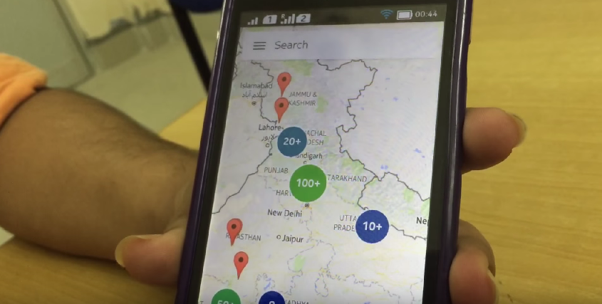
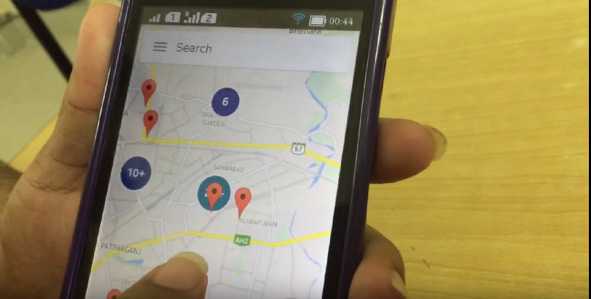
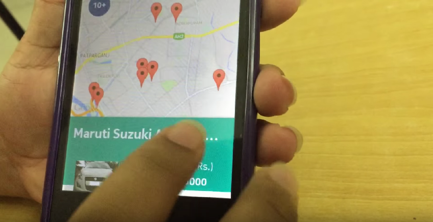

# QuiCAR

 * Map based visual take on the popular Quikr platform for classified advertising.
 * Displays sellers geographically on a Google Map on the basis of proximity.
 * Users can search for ads based on a product and brand.

_Currently supports only cars_

## Screenshot

## Demo Youtube URL

[https://www.youtube.com/watch?v=81IXwKzI-zg](https://www.youtube.com/watch?v=81IXwKzI-zg)

## Structure

### QuiCAR-Server

The server that powers QuiCAR. Handles interaction with the Quikr API. Provides a REST, JSON based searchable API for our android app.

### QuiCAR-Android

The android application used by the users.

## Developers

### Team xterm_inate

Abhishek Kandoi

Arpit Singla

Punit Dhoot

Dhaval Kapil
